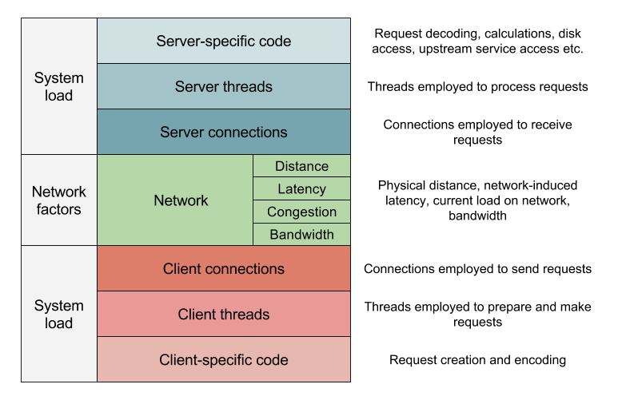

# Flechette - work in progress

Flechette is a Java project aimed at simplifying tests in a server-client architecture.
Flechette allows the creation of a server application and a client application with
built-in performance measurement. The metrics can be retrieved as JSON from the `/metrics`
endpoint.
Both server and client can be scaled horizontally.

An overview of different performance factors can be seen in the following image.

These factors are not completely comprehensive and include a bit of overlap, but do describe
the hypothesized causes of bad performance that was inspiration for writing Fletchette.

[STUPS Senza](http://stups.readthedocs.org/en/latest/components/senza.html) templates
are provided for deployment on AWS.

## Server

The server is a Spring Boot application. Fletchette provides a NOP service that just
returns a string response. More complex operations such as database reads or writes
or expensive calculations can also be implemented in order to run stress tests on them.

The embedded server, Tomcat by default, should be configured for every test.

### Building the server

    cd server
    mvn clean package
    docker build -t docker.com/fletchette-server:1.0 .
    docker push docker.com/fletchette-server:1.0

### Running the server locally

    java -jar target/fletchette-server-1.0-SNAPSHOT.jar

### Running the server on AWS

    senza create server.yaml PARAM1

## Client
The client is a Java application providing code for running stress tests on a server.
It allows specifying:

* the call to be made to the server,
* call timeout,
* frequency at which the calls should be executed,
* initial delay,
* thread count and
* ramp-up period.

### Building the client

    cd client
    mvn clean install
    docker build -t docker.com/fletchette-client:1.0 .
    docker push docker.com/fletchette-client:1.0

### Running the client locally

    java -jar target/flechette-server-1.0-SNAPSHOT.jar

### Running the client on AWS

    senza create client.yaml PARAM1

## Disabling services running

If by any chance you have a service, e.g. Tomcat, starting on the same port
Spring Boot tries to bind to by default, you can stop it from running on startup
with something like:

    sudo update-rc.d tomcat7 disable
